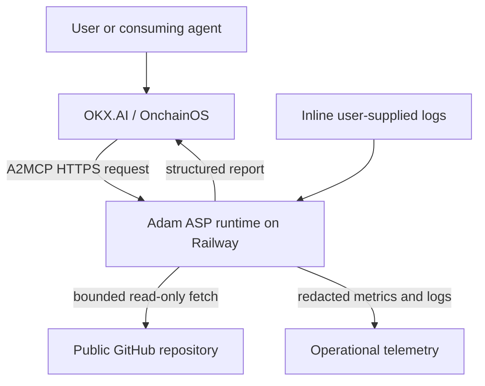
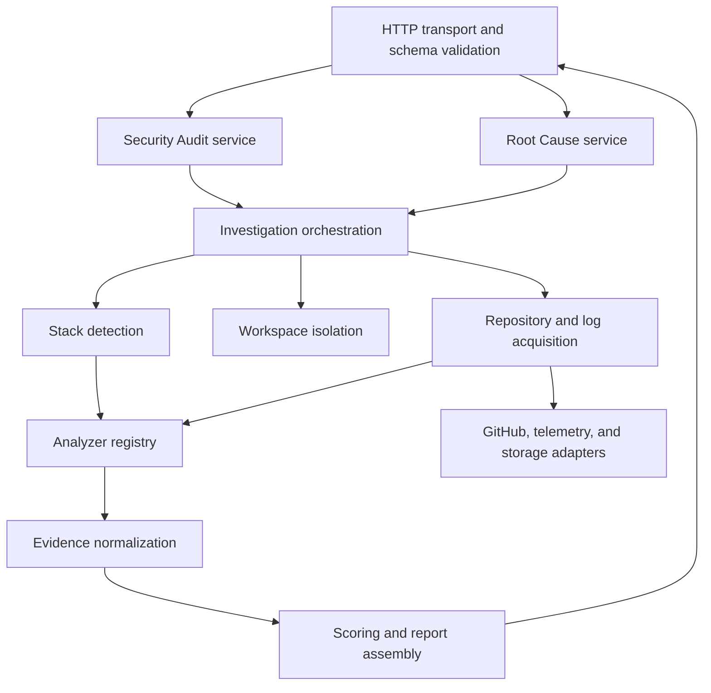
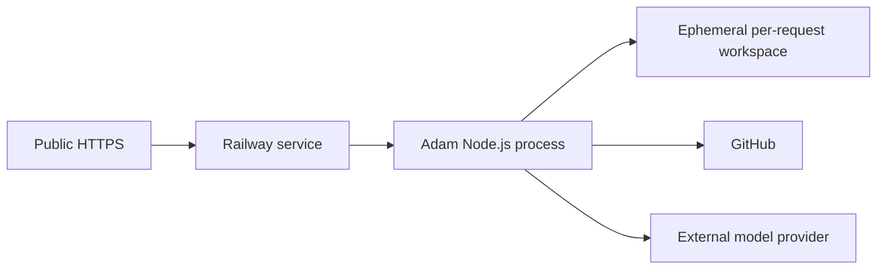

# Adam Architecture

| Field | Value |
| --- | --- |
| Status | Sprints 0-6 approved; Sprint 6.5 implemented pending review |
| Version | 0.6.5 |
| Last reviewed | July 24, 2026 |
| Scope | Architecture through Evidence Traceability and optional AI Intelligence |
| Implementation status | Deterministic services, orchestration, complete recommendation traceability, and optional evidence-constrained AI reasoning exist |

## 1. Purpose

Adam is an autonomous software engineering and security investigation service.
Its first two outcomes are:

1. a structured security audit of a public GitHub repository; and
2. a structured root cause investigation using a public GitHub repository and
   user-supplied logs.

Adam is intended to be registered as an OKX.AI Agent Service Provider and
invoked through an A2MCP service endpoint. This document defines how Adam should
fit into the documented OKX.AI and OnchainOS model without inventing platform
behavior that is not in the official documentation.

## 2. Official platform model

### 2.1 OnchainOS

The official documentation presents OnchainOS as an agent-oriented onchain
development platform with command-line tooling, Skills, MCP integrations,
wallet capabilities, and access to the OKX.AI agent economy.

OnchainOS is not Adam's application host. Adam remains responsible for its own
public service runtime, security controls, availability, data handling, and
deployment.

### 2.2 OKX.AI roles and identity

OKX.AI defines three economic roles:

- **User:** requests and pays for services;
- **ASP:** publishes and performs services;
- **Evaluator:** reviews disputed or quality-sensitive work when applicable.

The official Agent Identity documentation uses ERC-8004 identity primitives.
Identity and role registration make Adam discoverable and accountable, but do
not replace Adam's runtime or application data model.

Role registration, service registration, and service execution are separate
concerns:

1. Adam's operator registers an identity and ASP role.
2. Adam's operator registers one or more service definitions.
3. A user or agent invokes a registered service endpoint.
4. Adam's independently hosted runtime processes the request.

### 2.3 A2MCP

Official OKX.AI documentation describes A2MCP as a mode for standardized,
low-risk, API-like services with clear parameters and deterministic or
structured outputs. The service definition includes a name, description,
endpoint, price, and input method.

The A2MCP endpoint is an HTTP service contract. The documentation does not
require Adam to implement the Model Context Protocol server specification
inside its runtime merely because the marketplace mode is named A2MCP.

### 2.4 Free and paid A2MCP modes

The official A2MCP documentation supports two endpoint modes:

- a free service endpoint that returns its result directly; and
- an optional paid endpoint that uses x402.

x402 is not the A2MCP runtime. It is an optional monetization layer for a paid
service. Adam's Sprint 1 endpoints use the free mode and should be registered
with price `0`. No payment SDK, facilitator, Broker, settlement lifecycle, or
payment credential belongs in the Sprint 1 runtime.

Any future monetization requires a separate approved architecture decision.

### 2.5 A2A distinction

The official comparison describes A2A as the mode for customized, complex,
multi-step work and explicitly uses complete code or security audits as an
example.

This creates a genuine product-platform tension: Adam's full mission is complex,
while the project directive requires an A2MCP ASP rather than a legacy A2A
agent.

The proposed resolution for the initial release is:

- keep Adam as A2MCP;
- expose bounded, standardized investigation products;
- publish explicit input limits and result schemas;
- avoid open-ended autonomous task negotiation;
- defer asynchronous, negotiated, or unbounded investigations until OKX
  confirms the supported A2MCP pattern.

Adam must not silently add an A2A transport. A future A2A service would require
a separate architecture decision and explicit approval.

## 3. Architectural goals

### 3.1 Primary goals

- Present an extremely simple user-facing service.
- Produce evidence-backed conclusions rather than generic advice.
- Keep transport, investigation, and reporting responsibilities separate.
- Treat repositories and logs as hostile input.
- Operate entirely in cloud infrastructure.
- Scale from a single deployable service without forcing a premature
  distributed system.
- Preserve reproducibility through pinned dependencies and deterministic
  report schemas.

### 3.2 Non-goals for the initial release

- Private repository access.
- Arbitrary repository hosts.
- Executing untrusted repository code.
- Installing repository dependencies.
- Running repository builds, tests, deployment commands, or smart contracts.
- Automatically changing or opening pull requests against a user's repository.
- Interactive chatbot conversations.
- A2A task negotiation.
- General-purpose coding assistance.
- Permanent storage of cloned repositories or raw logs.

## 4. Major decisions

| ID | Decision | Reason |
| --- | --- | --- |
| AD-001 | Build a modular monolith first. | It provides clear boundaries without distributed-system overhead. Modules can later become services if measured load requires it. |
| AD-002 | Use TypeScript on the current supported Node.js LTS line, pinned at implementation time. | This follows the project rule and supports strong contracts across transport and service boundaries. |
| AD-003 | Host Adam as an independent HTTPS service on Railway. | The ASP endpoint must remain online without a developer computer, and Railway provides managed deployment, networking, variables, and health checks. |
| AD-004 | Register Sprint 1 A2MCP services as free endpoints. | Official A2MCP supports price `0`; payment is optional and has not been approved for Adam. |
| AD-005 | Keep A2MCP operations bounded and schema-driven. | The official documentation positions A2MCP as standardized API work, while Adam's broader mission can become open-ended. |
| AD-006 | Perform static inspection only in the initial release. | Running attacker-controlled code would materially expand the threat model and infrastructure cost. |
| AD-007 | Clone repositories into per-request ephemeral workspaces. | This prevents cross-request contamination and avoids retaining source code unnecessarily. |
| AD-008 | Maintain a normalized evidence model before generating conclusions. | Findings must be traceable, deduplicated, ranked, and testable independently of presentation. |
| AD-009 | Keep service orchestrators separate from analyzers. | The user asks for an outcome; orchestration decides which internal capabilities are needed without exposing module choices. |
| AD-010 | Persist operational runtime identity only; keep business processing stateless. | Railway Volume storage satisfies operational continuity without retaining repositories, logs, or reports. |
| AD-011 | Add a queue and durable job store only after an official async contract is confirmed. | Polling and asynchronous job semantics are not defined clearly enough to invent. |
| AD-012 | Use a reproducible container deployment once implementation begins. | A reviewed Dockerfile pins the runtime and system dependencies more explicitly than relying on ambient build detection. |
| AD-013 | Keep AI intelligence optional and downstream of deterministic evidence. | A model may explain approved findings but cannot create findings, alter scores, or replace root-cause selection. |

## 5. System context



### 5.1 Trust boundaries

1. **Marketplace boundary:** request metadata arrives from outside Adam.
2. **Public network boundary:** the repository host is untrusted even when the
   URL looks valid.
3. **Content boundary:** source files, Git metadata, configuration, and logs can
   contain malicious payloads or secrets.
4. **Analysis boundary:** analyzers may disagree or produce low-confidence
   signals.
5. **Operations boundary:** telemetry must not become a secondary store of
   source code, secrets, or raw logs.

## 6. Logical architecture



### 6.1 HTTP transport

Responsibilities:

- expose health and service routes;
- validate request shape and content type;
- enforce body-size and timeout limits;
- attach a request and correlation ID;
- map typed application failures to stable HTTP errors;
- serialize versioned response contracts;
- configure only the CORS headers required by official clients.

It must not contain investigation logic.

### 6.2 A2MCP registration boundary

ASP identity and service registration are deployment concerns, not application
middleware. Sprint 1 exposes normal HTTPS routes and registers them with price
`0`.

Responsibilities:

- document the public endpoint and input method;
- keep service names and route metadata versioned;
- verify the registered endpoint returns structured JSON;
- avoid adding payment middleware without explicit approval.

### 6.3 Service layer

There will be one orchestrator per user outcome:

- `SecurityAuditService`
- `RootCauseInvestigationService`

Each service will:

- enforce product-specific scope;
- select the required analysis capabilities;
- coordinate acquisition, analysis, evidence, and reporting;
- return a versioned service result;
- avoid exposing internal module selection to the user.

### 6.4 Investigation core

The investigation core owns reusable engineering concepts:

- repository manifest;
- detected stack and confidence;
- source location;
- log event;
- evidence item;
- hypothesis;
- finding;
- remediation;
- analysis limitation.

It must not depend on HTTP, Railway, or OKX.AI registration tooling.

### 6.5 Repository acquisition

Sprint 2 behavior:

- accept HTTPS URLs for public GitHub repositories only;
- normalize owner and repository names;
- resolve and record the immutable commit SHA used for analysis;
- use a shallow, single-branch, no-tags Git clone;
- disable credential prompts;
- reject unsupported submodules and Git LFS requirements initially;
- clean the workspace after the request.

Repository acquisition must not execute hooks or repository-provided commands.

### 6.6 Log acquisition

Initial behavior:

- accept bounded inline text logs in the service request;
- label each log by user-provided source such as deployment, runtime, or CI;
- normalize timestamps and line endings when possible;
- preserve original line references for evidence;
- redact likely credentials before telemetry or model processing;
- reject arbitrary remote log URLs in the first release.

### 6.7 Stack detection

Stack detection will use repository evidence such as manifests, lockfiles,
configuration files, source extensions, framework files, and contract layouts.

Detection output must include:

- identified language, framework, package manager, and deployment tooling;
- confidence for each identification;
- evidence locations;
- limitations and conflicts.

No single filename should be treated as conclusive when evidence conflicts.

Sprint 2 implements deterministic detection only. It does not install
dependencies, execute repository code, invoke a model, identify
vulnerabilities, or generate investigation conclusions.

### 6.8 Analyzer registry

Analyzers are small, independently testable capabilities. Proposed categories:

- dependency and lockfile analysis;
- secret exposure;
- authentication;
- authorization;
- configuration and environment handling;
- web application security;
- smart contract security;
- CI/CD and deployment configuration;
- log pattern extraction;
- failure timeline construction;
- code-to-log correlation.

An analyzer:

- declares the stacks and evidence types it supports;
- receives normalized, read-only investigation input;
- returns deterministic finding candidates, not final prose;
- never calls another analyzer directly;
- never knows about marketplace registration or HTTP.

The registry selects analyzers based on detected stack and service needs. The
user never selects them manually.

### 6.9 Evidence model

Every finding or root-cause claim must reference one or more evidence items.

A normalized evidence item should include:

- stable evidence ID;
- evidence type;
- source file or log source;
- line or region reference when available;
- sanitized excerpt or structured fact;
- collection method;
- confidence;
- sensitivity classification.

The final report may summarize evidence, but it must not create unsupported
facts that are absent from the evidence model.

### 6.10 Reporting

Security Audit output:

- report schema version;
- analyzed repository and immutable commit SHA;
- analysis scope and limitations;
- security score and scoring version;
- Critical, High, Medium, and Low findings;
- confidence, evidence, impact, and remediation per finding;
- positive controls observed when useful;
- unresolved questions.

Root Cause Investigation output:

- report schema version;
- analyzed repository and immutable commit SHA;
- root-cause statement;
- confidence;
- supporting and contradicting evidence;
- affected component;
- recommended fix;
- prevention measures;
- alternative hypotheses;
- analysis limitations.

Security scoring must be deterministic from normalized findings and a versioned
formula. A language model must not choose an unexplained score.

## 7. Proposed service contracts

These are Adam design proposals, not official OKX API names. Registration
metadata and final route shape must be validated against the current CLI and
dashboard before implementation.

### 7.1 Security Audit

Proposed route:

`POST /v1/security-audits`

Conceptual input:

```json
{
  "repositoryUrl": "https://github.com/owner/repository",
  "ref": "optional-branch-tag-or-commit"
}
```

Conceptual result:

```json
{
  "schemaVersion": "1.0",
  "status": "completed",
  "repository": {
    "url": "https://github.com/owner/repository",
    "commitSha": "immutable-sha"
  },
  "securityScore": {
    "value": 0,
    "scoringVersion": "1.0"
  },
  "findings": [],
  "limitations": []
}
```

### 7.2 Root Cause Investigation

Proposed route:

`POST /v1/root-cause-investigations`

Conceptual input:

```json
{
  "repositoryUrl": "https://github.com/owner/repository",
  "ref": "optional-branch-tag-or-commit",
  "logs": [
    {
      "source": "deployment",
      "content": "bounded inline log content"
    }
  ]
}
```

Conceptual result:

```json
{
  "schemaVersion": "1.0",
  "status": "completed",
  "rootCause": {
    "summary": "evidence-backed conclusion",
    "confidence": "high",
    "evidenceIds": []
  },
  "recommendedFixes": [],
  "prevention": [],
  "alternativeHypotheses": [],
  "limitations": []
}
```

### 7.3 Health endpoints

- `GET /healthz`: process is alive; no external dependency checks.
- `GET /readyz`: service configuration and required integrations are ready.

Health endpoints are not paid operations and must expose no sensitive
configuration.

## 8. Request lifecycle

1. Receive an HTTPS request.
2. Assign a correlation ID and enforce transport limits.
3. Validate the request shape before any expensive work.
4. Validate repository scope and normalize the request.
5. Create an isolated temporary workspace.
6. Resolve and fetch the target immutable Git commit.
7. Detect stack and select applicable analyzers.
8. Collect and normalize evidence.
9. Build findings or root-cause hypotheses.
10. Assemble and validate the versioned report.
11. Return the structured response.
12. Delete temporary repository and log artifacts.
13. Emit redacted metrics and structured operational logs.

All cleanup must run on success, failure, timeout, and cancellation.

## 9. Security architecture

### 9.1 Untrusted repository controls

- Allowlist the initial host to `github.com` HTTPS repositories.
- Reject credentials embedded in URLs.
- Resolve redirects carefully and reject private, loopback, link-local, and
  metadata-service network destinations.
- Apply repository byte, file-count, file-size, depth, and analysis-time limits.
- Disable Git hooks and interactive credential helpers.
- Do not recursively initialize submodules in the initial release.
- Treat symbolic links as data and prevent traversal outside the workspace.
- Never run package scripts, compilers, tests, binaries, containers, or smart
  contracts from the target repository.
- Delete the workspace after every request.

### 9.2 Secret and log controls

- Never write private keys, access tokens, or complete user logs to telemetry.
- Redact common credential forms before external model calls or logging.
- Mark sensitive evidence so reports can summarize without reproducing a full
  secret.
- Keep raw repositories and logs only for the active request.
- Define a documented retention policy before introducing durable storage.

### 9.3 Model safety

Repository text and logs can contain prompt injection. They must be treated as
untrusted evidence, never as instructions.

Any model adapter must:

- place system policy and task instructions outside untrusted content;
- clearly delimit source material;
- prohibit tool execution requested by repository text;
- require evidence IDs for conclusions;
- use structured output validation;
- record model and prompt versions for reproducibility;
- fail closed when output does not match the schema.

### 9.4 Availability and abuse controls

- Enforce body-size, clone-size, file-count, and wall-clock limits.
- Apply concurrency caps based on measured memory and CPU use.
- Rate-limit abusive or repeated requests.
- Use idempotency keys if supported by the final service contract.
- Return stable errors without exposing stack traces.

## 10. Deployment architecture

### 10.1 Initial Railway topology

One Railway service will host the modular monolith:



The process must listen on Railway's injected `PORT`. Railway variables will
hold secrets and environment-specific configuration. A reviewed
`railway.json` will define deployment policy, health-check path, and restart
behavior.

Sprint 1 uses a Railway Volume mounted at `/data` for a small operational state
file containing instance identity, first start time, last start time, and boot
count. Repository workspaces remain disposable, and no user input, report,
or credential is stored there.

### 10.2 Deployment artifact

The recommended production artifact is a minimal multi-stage Docker image:

- pin the supported Node.js LTS version;
- install only production dependencies in the runtime image;
- run as a non-root user;
- include only compiled application files and required static metadata;
- define no credentials in image layers;
- expose no shell or debug service publicly.

The exact base image will be selected and security-scanned during the
implementation milestone.

### 10.3 Configuration

Configuration will be parsed once at startup and exposed as a typed,
read-only object. Missing or invalid required configuration must prevent
readiness.

Expected configuration categories:

- runtime environment and port;
- public base URL;
- log level;
- GitHub acquisition limits;
- request and analysis limits;
- model provider credentials and model selection;
- telemetry exporters;
- feature flags for explicitly approved analyzers.

No secret defaults will be committed.

### 10.4 Observability

Structured logs:

- request ID and service name;
- high-level lifecycle stage;
- duration and resource-limit outcomes;
- analyzer counts and statuses;
- report status;
- error code and retryability.

Metrics:

- request count by service and status;
- request and stage latency;
- repository size distribution;
- analyzer failure rate;
- model latency and structured-output failure rate;
- timeout, limit, and cleanup failures;
- process memory and CPU saturation.

Traces may be added if stage-level logs are insufficient. Raw source and log
content must not be trace attributes.

## 11. Scaling path

The modular monolith is the correct starting point, not the permanent ceiling.

### Stage 1: single stateless service

- bounded synchronous A2MCP operations;
- per-request ephemeral workspace;
- no durable job state;
- one deployment unit;
- horizontal scaling only after concurrency behavior is measured.

### Stage 2: isolated worker execution

Trigger conditions:

- analysis exceeds safe HTTP duration;
- clone and analyzer workloads cause API saturation;
- independent autoscaling is needed;
- stricter process or container isolation is required.

Potential topology:

- public API service;
- private investigation workers;
- durable queue;
- PostgreSQL job metadata;
- object storage for encrypted, time-limited artifacts.

This stage requires an approved A2MCP asynchronous service contract before
implementation.

### Stage 3: specialized worker pools

Only introduce stack- or analyzer-specific worker pools when measurements show
different runtime, dependency, or isolation requirements. Service boundaries
should follow operational pressure, not the source directory structure.

## 12. Error model

Errors will be stable, typed, and separated into:

- invalid request;
- unsupported repository or content;
- repository unavailable;
- configured limit exceeded;
- analysis incomplete;
- upstream dependency unavailable;
- internal failure.

Each error response should contain:

- schema version;
- stable error code;
- safe human-readable message;
- request ID;
- retryability;
- sanitized details when useful.

## 13. Testing strategy

### Unit tests

- schema validation;
- URL normalization and SSRF defenses;
- stack detection rules;
- evidence normalization;
- finding deduplication;
- severity and score calculation;
- log parsing;
- report validation;
- error mapping.

### Integration tests

- bounded Git clone against fixtures;
- workspace cleanup on all exit paths;
- analyzer orchestration;
- model adapter structured-output validation;
- Railway-style configuration startup;

### Contract tests

- service request and response schemas;
- OKX.AI service registration input shape.

### Security tests

- private-address and redirect SSRF attempts;
- credential-bearing repository URLs;
- oversized repositories and files;
- symlink traversal;
- malicious filenames and encodings;
- prompt injection in source and logs;
- secret redaction;
- timeout and cancellation cleanup;

### End-to-end tests

- register or configure a test service;
- invoke the free A2MCP endpoint;
- receive a schema-valid Adam report;
- verify operational logs;
- repeat against the deployed Railway revision.

## 14. Recommended repository structure

```text
.
|-- .github/
|   |-- CODEOWNERS
|   |-- dependabot.yml
|   `-- workflows/
|       |-- ci.yml
|       `-- security.yml
|-- docs/
|   |-- OFFICIAL_SOURCES.md
|   |-- adr/
|   |   `-- 0001-modular-monolith.md
|   |-- operations/
|   |   |-- deployment.md
|   |   `-- incident-response.md
|   `-- service-contracts/
|       |-- root-cause-investigation.md
|       `-- security-audit.md
|-- src/
|   |-- analyzers/
|   |   |-- auth/
|   |   |-- authorization/
|   |   |-- configuration/
|   |   |-- dependencies/
|   |   |-- logs/
|   |   |-- secrets/
|   |   `-- smart-contracts/
|   |-- config/
|   |-- investigation/
|   |   |-- evidence/
|   |   |-- repository/
|   |   |-- stack/
|   |   `-- workspace/
|   |-- platform/
|   |   |-- github/
|   |   |-- models/
|   |   `-- observability/
|   |-- reporting/
|   |-- services/
|   |   |-- root-cause-investigation/
|   |   `-- security-audit/
|   |-- shared/
|   |-- transport/
|   |   `-- http/
|   |-- app.ts
|   `-- server.ts
|-- test/
|   |-- contract/
|   |-- fixtures/
|   |-- integration/
|   |-- security/
|   `-- unit/
|-- .dockerignore
|-- .editorconfig
|-- .env.example
|-- .gitignore
|-- ARCHITECTURE.md
|-- CONTRIBUTING.md
|-- Dockerfile
|-- README.md
|-- eslint.config.js
|-- package-lock.json
|-- package.json
|-- railway.json
`-- tsconfig.json
```

### Structure reasoning

- `services/` owns user outcomes, not low-level capabilities.
- `analyzers/` contains independent evidence producers.
- `investigation/` contains reusable domain concepts and orchestration support.
- `transport/` isolates HTTP and serialization.
- `platform/` contains replaceable external adapters.
- `reporting/` centralizes deterministic scoring and report assembly.
- `test/contract/` protects public service interfaces from accidental change.
- `docs/adr/` records important future decisions without rewriting history.
- `docs/operations/` keeps deployment and incident knowledge versioned with the
  code.

Directories must be created only when their first real implementation or
document is added.

## 15. Identified flaws and improvements

### 15.1 Full audits do not naturally fit the documented A2MCP profile

**Flaw:** Full repository investigations can be open-ended and long-running,
while official guidance positions A2MCP as a standardized API mode.

**Improvement:** Begin with bounded repository sizes, supported stacks,
standardized report schemas, and explicit time limits. Seek official
confirmation before adding asynchronous jobs.

### 15.2 Monetization can distort the initial service design

**Flaw:** Treating optional x402 monetization as required A2MCP infrastructure
adds credentials, settlement failure modes, and SDK coupling before the service
contract is proven.

**Improvement:** Keep Sprint 1 free and payment-free. Revisit monetization only
through a separate architecture decision after the service behavior is stable.

### 15.3 Static-only analysis limits certainty

**Flaw:** Some vulnerabilities and failures require builds, tests, runtime
reproduction, or chain simulation.

**Improvement:** Be explicit about limitations and confidence. Introduce
sandboxed execution later as a separate security architecture, not as an
unreviewed extension of static analysis.

### 15.4 Arbitrary repository access creates major security risk

**Flaw:** Fetching user-controlled URLs creates SSRF, resource exhaustion, and
content-handling risks.

**Improvement:** Restrict the initial release to normalized public GitHub URLs,
apply strict limits, and never execute fetched code.

### 15.5 Model-generated reports can sound more certain than evidence allows

**Flaw:** Fluent prose can hide weak or contradictory evidence.

**Improvement:** Require structured evidence references, preserve alternative
hypotheses, display confidence, and compute the security score from versioned
rules.

### 15.6 Premature persistence would increase privacy and operational burden

**Flaw:** Storing source and logs "for later" creates sensitive data retention
without a validated product need.

**Improvement:** Keep the first release stateless and delete artifacts after
each request. Add durable storage only with encryption, retention, deletion,
and access-control policies.

### 15.7 Official hackathon dates are inconsistent

**Flaw:** Official localized/current pages reviewed on July 22, 2026 showed
conflicting end dates of July 17 and July 27, 2026.

**Improvement:** Treat the participant dashboard and organizer confirmation as
the source of truth for submission timing. Do not encode a deadline into the
application.

## 16. Open decisions requiring approval

1. Confirm the bounded A2MCP interpretation for the two investigation services.
2. Confirm public GitHub-only and static-inspection-only MVP scope.
3. Confirm whether the two outcomes should be registered as separate free
   services.
4. Confirm the model provider and data-processing policy.
5. Confirm request limits after a benchmark spike.
6. Confirm the intended public GitHub repository and configure `origin`.
7. Confirm the open-source license.
8. Confirm the official hackathon submission deadline in the participant
    dashboard.

## 17. Milestone gates

### Sprint 1 implementation status

- TypeScript pnpm workspace: complete.
- Configuration validation: complete.
- Structured logging and redaction: complete.
- HTTP server and required routes: complete.
- Planner and placeholder services: complete.
- Free A2MCP HTTP service boundary: complete.
- Persistent operational runtime state: complete.
- Automated tests and architecture checks: complete.

### Sprint 2 implementation status

- Public GitHub HTTPS URL normalization: complete.
- Shallow Git acquisition and immutable commit capture: complete.
- Ephemeral workspace cleanup: complete.
- Ignored generated-directory enforcement: complete.
- Internal Repository Model: complete.
- Language, framework, and package-manager detection: complete.
- Docker, CI/CD, Solidity, environment, and configuration detection: complete.
- Structured repository summary endpoint: complete.
- Planner repository-intelligence prerequisite: complete.
- Vulnerability detection, AI reasoning, reporting, and root cause analysis:
  intentionally not implemented.
- CI, Dockerfile, and Railway configuration: complete.

### Sprint 3 implementation status

- Bounded source-text extension of the Repository Model: complete.
- Secrets Scanner: complete.
- Dependency Inspector with offline risky-package policies: complete.
- Authentication & Authorization Inspector: complete.
- Configuration Inspector: complete.
- Static Security Pattern Inspector: complete.
- Conditional Solidity Smart Contract Inspector: complete.
- Deterministic finding IDs, severity, file/line, evidence, and confidence:
  complete.
- Structured `POST /audit` response: complete.
- Secret evidence redaction and workspace cleanup: complete.
- Security scores, remediation generation, narrative reports, AI reasoning, and
  Root Cause Investigation were deferred from Sprint 3; approved scoring and
  investigation capabilities are implemented in Sprints 4 and 5.

### Sprint 4 implementation status

- Rule-aware Security Intelligence Layer: complete.
- Evidence-referenced explanation, importance, impact, likelihood,
  remediation, and confidence for every finding: complete.
- Deterministic category scoring with versioned formula: complete.
- Overall score and risk rating: complete.
- Recommended fix ordering: complete.
- Structured professional Security Report: complete.
- External model provider: intentionally not introduced because provider and
  data-processing policy remain unapproved.
- Root Cause Investigation was deferred from Sprint 4 and is implemented
  independently in Sprint 5.

### Sprint 5 implementation status

- Public GitHub repository plus bounded inline log input: complete.
- Build, runtime, CI, stack-trace, and error-message normalization: complete.
- Secret redaction and stable supporting log entry IDs: complete.
- Repository, file, dependency, configuration, and stack correlation: complete.
- Extensible detector registry covering all approved root-cause categories:
  complete.
- Candidate scoring, ranking, confidence, evidence, impact, recommended fixes,
  and prevention: complete.
- Conditional smart-contract deployment detection for Solidity repositories:
  complete.
- Production `POST /investigate` endpoint and cleanup guarantees: complete.
- Conversational AI, Planner Intelligence, and multi-service orchestration:
  were intentionally deferred from Sprint 5.

### Sprint 6 implementation status

- Deterministic natural-language intent classification: complete.
- Repository, Security Audit, Root Cause, and combined intent support:
  complete.
- Dependency-resolved execution plan generation: complete.
- Registry-based Service Orchestrator: complete.
- Shared request-scoped Repository Model and execution context: complete.
- Single repository acquisition across multi-service plans: complete.
- Planner decisions and execution timeline: complete.
- Unified repository, security, root-cause, risk, and recommendation response:
  complete.
- Production `POST /plan` endpoint: complete.
- Security Audit Engine, Security Score, and Root Cause Engine algorithms:
  unchanged.
- Conversational chat, external LLM providers, and new A2MCP integrations:
  intentionally not implemented.

### Sprint 6.5 implementation status

- Evidence Link Resolver and Evidence Traceability Engine: complete.
- Stable recommendation, finding, evidence, file, line, rule, confidence, and
  source-service links: complete.
- Deterministic mode remains the default: complete.
- Optional AI Intelligence Engine, Prompt Builder, Reasoning Formatter, and
  provider adapter: complete.
- Strict finding-ID validation and bounded result caching: complete.
- Security and Root Cause algorithms: unchanged.
- New services, conversational chat, and Sprint 7 functionality: not
  implemented.

The project stops for review after Sprint 6.5.
