# Adam

Adam is an autonomous software engineering and security investigation agent being
designed as an Agent Service Provider (ASP) for OKX.AI.

Adam inspects software systems, correlates technical evidence, and returns
prioritized, actionable conclusions. It is not a chatbot, an IDE autocomplete
tool, a generic code generator, or a hackathon judging agent.

## Project status

**Sprint 6: Planner & Service Orchestration**

Sprints 1 through 5 are approved. The repository now contains:

- a Node.js and TypeScript pnpm workspace;
- a modular Express API;
- a free A2MCP-compatible HTTP service boundary;
- a request planner with repository-intelligence prerequisites;
- bounded public GitHub repository acquisition through Git;
- a reusable internal Repository Model;
- deterministic language, framework, package-manager, Docker, CI/CD, Solidity,
  environment-file, and configuration-file detection;
- independent secrets, dependency, authentication/authorization,
  configuration, static-pattern, and Solidity inspectors;
- deterministic structured security findings with severity, evidence,
  file/line, and confidence;
- rule-aware explanations, impact analysis, likelihood, remediation, and
  evidence references for every finding;
- deterministic versioned security scoring by category;
- overall risk ratings and recommended fix ordering;
- a professional structured Security Report;
- a deterministic Root Cause Investigation pipeline for repository and log
  correlation;
- independent, extensible root-cause detector categories with ranked
  evidence-backed candidates;
- structured impact, fix, prevention, related-file, related-dependency, and
  supporting-log output;
- deterministic natural-language intent classification;
- dependency-resolved execution plans and a registry-based service
  orchestrator;
- one shared Repository Model across multi-service requests;
- unified repository, security, root-cause, risk, recommendation, and execution
  metadata responses;
- structured logging and persistent operational runtime state;
- Docker, Railway, and GitHub Actions configuration.

Conversational chat, external-model reasoning, and new A2MCP integrations remain
intentionally unimplemented.

Last documentation review: **July 24, 2026**

## Initial services

### Security Audit

Given a public GitHub repository, Adam:

- map the repository and detect its technology stack;
- inspect dependencies, configuration, secrets exposure, authentication, and
  authorization;
- inspect smart contracts when present;
- detect deterministic static security patterns;
- explain every finding using its recorded evidence;
- calculate transparent category and overall security scores;
- return severity-grouped findings, a recommended fix order, and a structured
  professional report.

Sprint 4 intelligence is deterministic and rule-aware. It does not send
repository evidence to an external model or claim runtime exploitability.

### Root Cause Investigation

Given a public GitHub repository and deployment, runtime, CI, stack-trace, or
error logs, Adam:

- understand the relevant repository structure;
- normalize and correlate failures across code, configuration, and logs;
- identify the most probable root cause;
- state confidence and supporting evidence;
- recommend a fix and prevention measures.

Sprint 5 uses deterministic signatures and repository correlation. It does not
execute the repository, reproduce the failing system, or invent causes without
supporting evidence.

### Planner & Service Orchestration

Given a natural-language request, repository URL, and optional logs, Adam:

- classifies repository, security, root-cause, or combined intent;
- generates a dependency-ordered execution plan;
- clones and scans the repository once;
- executes approved services against one shared Repository Model;
- aggregates service outputs without changing their findings or scores;
- returns one deterministic unified response with an execution timeline.

Broad combined requests without logs run Repository Intelligence and Security
Audit while documenting why Root Cause Investigation was omitted. Explicit
failure investigations require logs and fail validation rather than guessing.

## Product principles

- **Simple input:** users request an outcome, not a collection of analysis
  modules.
- **Evidence first:** every conclusion must be traceable to repository or log
  evidence.
- **Safe by default:** untrusted repositories are inspected without executing
  their code in the initial release.
- **Cloud first:** the production service must not depend on a developer
  computer remaining online.
- **Bounded services:** the initial A2MCP operations will have explicit,
  enforceable scope and input limits.
- **Professional engineering:** strong typing, structured logging, clear
  ownership, and production-grade error handling are required when
  implementation begins.

## Architecture at a glance

```mermaid
flowchart LR
    Client["OnchainOS / OKX.AI client"]
    API["Adam HTTP boundary"]
    Planner["Internal planner"]
    Classifier["Intent classifier"]
    Plan["Execution planner"]
    Workspace["Shared execution context"]
    RepositoryModel["Repository Model"]
    Services["Approved service registry"]
    Aggregate["Response aggregator"]

    Client -->|"A2MCP HTTP request"| API
    API --> Classifier
    Classifier --> Plan
    Plan --> Planner
    Planner --> Workspace
    Workspace --> RepositoryModel
    RepositoryModel --> Services
    Services --> Aggregate
    Aggregate --> API
    API -->|"structured result"| Client
```



Adam will run as an independently hosted HTTPS service. OKX.AI provides
identity, discovery, and service registration; Adam owns the investigation
runtime and its operational security.

See [ARCHITECTURE.md](ARCHITECTURE.md) for the complete proposed design and
[docs/OFFICIAL_SOURCES.md](docs/OFFICIAL_SOURCES.md) for the reviewed official
documentation and known ambiguities.

## Repository layout

```text
.
|-- .github/
|   `-- workflows/
|-- docs/
|   |-- OFFICIAL_SOURCES.md
|   |-- adr/
|   |-- operations/
|   `-- service-contracts/
|-- apps/
|   `-- api/
|       |-- src/
|       `-- test/
|-- packages/
|   `-- contracts/
|-- scripts/
|-- ARCHITECTURE.md
|-- CONTRIBUTING.md
|-- Dockerfile
|-- README.md
|-- package.json
|-- pnpm-workspace.yaml
|-- tsconfig.base.json
`-- railway.json
```

Directories are introduced only when they contain working code or active
documentation. External model adapters, chat modules, and new A2MCP adapters do
not exist.

## Run locally

Requirements:

- Node.js 22 or newer;
- Corepack;
- pnpm 11.15.1.

```powershell
corepack enable
pnpm install
Copy-Item .env.example .env
pnpm dev
```

The API listens on `http://localhost:4000` by default.

```text
GET  /
GET  /health
POST /repository/summary
POST /audit
POST /investigate
POST /plan
```

`POST /repository/summary` accepts:

```json
{
  "repositoryUrl": "https://github.com/onchaindc/Adam"
}
```

It returns a structured repository summary. `POST /audit` accepts the same
request and returns enriched findings, scoring, fix order, and a structured
Security Report. `POST /investigate` accepts a repository URL plus bounded
inline logs and returns a structured root-cause investigation.

```json
{
  "repositoryUrl": "https://github.com/onchaindc/Adam",
  "logs": [
    {
      "source": "build",
      "label": "Railway build",
      "content": "Error: Cannot find module 'express'"
    }
  ]
}
```

`POST /plan` accepts:

```json
{
  "request": "Audit this repository and explain why deployment failed",
  "repositoryUrl": "https://github.com/onchaindc/Adam",
  "logs": [
    {
      "source": "runtime",
      "content": "Error: Cannot find module 'express'"
    }
  ]
}
```

It returns the classification, execution plan, executed services, repository
overview, optional security and root-cause results, overall risk,
recommendations, and execution metadata.

Run all repository checks:

```powershell
pnpm verify
```

## A2MCP service boundary

Adam exposes ordinary HTTPS endpoints with structured JSON input and output.
The official A2MCP registration flow supports free services, so Sprint 1 has no
payment SDK or settlement runtime. Adam should be registered with price `0`
until monetization is explicitly designed and approved.

## Deploy to Railway

1. Create a Railway service from this GitHub repository.
2. Attach a Railway Volume mounted at `/data`.
3. Set `STATE_FILE=/data/runtime-state.json`.
4. Add the variables documented in `.env.example`.
5. Deploy. Railway builds the root `Dockerfile` and checks `GET /health`.

See [docs/operations/deployment.md](docs/operations/deployment.md) for the full
deployment variable list.

## Milestone plan

1. **Milestone 0:** approve architecture, service boundaries, deployment model,
   and official integration assumptions.
2. **Milestone 1:** complete and approved. Typed service foundation,
   free A2MCP HTTP boundary, persistent operational state, health routes,
   placeholder services, logging, CI, Docker, and Railway configuration.
3. **Milestone 2:** complete and approved. Public GitHub acquisition,
   Repository Model, file-tree scanning, and stack detection.
4. **Milestone 3:** complete and approved. Deterministic Security Audit Engine
   and structured findings.
5. **Milestone 4:** complete and approved. Security Intelligence Layer, deterministic scoring,
   evidence-bound remediation, fix ordering, and structured reporting.
6. **Milestone 5:** complete and approved. Deterministic Root Cause Investigation pipeline, ranked
   causes, evidence, fixes, prevention, and production endpoint.
7. **Milestone 6:** deterministic Planner, shared execution context,
   dependency-ordered orchestration, and unified response.
8. **Milestone 7:** harden isolation, observability, reliability, and Railway
   deployment.
9. **Milestone 8:** register, validate, and publish the ASP service in OKX.AI.

Each milestone requires review before the next milestone begins.

## Current constraints

- The first release supports public GitHub repositories only.
- Adam will not execute repository scripts, package managers, builds, tests, or
  smart contracts by default.
- Repository acquisition is shallow, non-interactive, temporary, and bounded by
  configurable clone-time, file-count, and directory-depth limits.
- Private repository authentication, arbitrary log URLs, asynchronous jobs, and
  A2A task handling are outside the initial approved scope.
- Exact request limits, final pricing, and production service metadata remain
  approval items.

## Repository and license

The canonical repository is `https://github.com/onchaindc/Adam`.

No open-source license has been selected. Until a license is added, standard
copyright restrictions apply.
