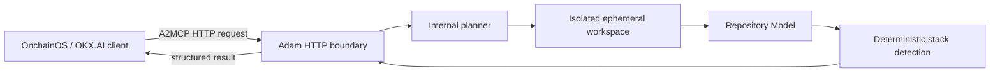

# Adam

Adam is an autonomous software engineering and security investigation agent being
designed as an Agent Service Provider (ASP) for OKX.AI.

Adam inspects software systems, correlates technical evidence, and returns
prioritized, actionable conclusions. It is not a chatbot, an IDE autocomplete
tool, a generic code generator, or a hackathon judging agent.

## Project status

**Sprint 2: Repository Intelligence**

Sprint 1 is approved. The repository now contains:

- a Node.js and TypeScript pnpm workspace;
- a modular Express API;
- a free A2MCP-compatible HTTP service boundary;
- a request planner with repository-intelligence prerequisites;
- bounded public GitHub repository acquisition through Git;
- a reusable internal Repository Model;
- deterministic language, framework, package-manager, Docker, CI/CD, Solidity,
  environment-file, and configuration-file detection;
- structured logging and persistent operational runtime state;
- Docker, Railway, and GitHub Actions configuration.

Vulnerability detection, root cause reasoning, AI reasoning, and report
generation remain intentionally unimplemented.

Last documentation review: **July 22, 2026**

## Initial services

### Security Audit

Given a public GitHub repository, Adam will:

- map the repository and detect its technology stack;
- inspect dependencies, configuration, secrets exposure, authentication, and
  authorization;
- inspect smart contracts when present;
- identify and prioritize likely vulnerabilities;
- explain evidence, impact, and remediation;
- return a security score and severity-ranked findings.

The emphasis is evidence-backed engineering reasoning, not merely matching a
vulnerability signature database.

### Root Cause Investigation

Given a public GitHub repository and deployment, runtime, or CI logs, Adam will:

- understand the relevant repository structure;
- normalize and correlate failures across code, configuration, and logs;
- identify the most probable root cause;
- state confidence and supporting evidence;
- recommend a fix and prevention measures.

## Product principles

- **Simple input:** users request an outcome, not a collection of analysis
  modules.
- **Evidence first:** every conclusion must be traceable to repository or log
  evidence.
- **Safe by default:** untrusted repositories are inspected without executing
  their code in the initial release.
- **Cloud first:** the production service must not depend on a developer
  computer remaining online.
- **Bounded services:** the initial A2MCP operations will have explicit,
  enforceable scope and input limits.
- **Professional engineering:** strong typing, structured logging, clear
  ownership, and production-grade error handling are required when
  implementation begins.

## Architecture at a glance



Adam will run as an independently hosted HTTPS service. OKX.AI provides
identity, discovery, and service registration; Adam owns the investigation
runtime and its operational security.

See [ARCHITECTURE.md](ARCHITECTURE.md) for the complete proposed design and
[docs/OFFICIAL_SOURCES.md](docs/OFFICIAL_SOURCES.md) for the reviewed official
documentation and known ambiguities.

## Repository layout

```text
.
|-- .github/
|   `-- workflows/
|-- docs/
|   |-- OFFICIAL_SOURCES.md
|   |-- adr/
|   |-- operations/
|   `-- service-contracts/
|-- apps/
|   `-- api/
|       |-- src/
|       `-- test/
|-- packages/
|   `-- contracts/
|-- scripts/
|-- ARCHITECTURE.md
|-- CONTRIBUTING.md
|-- Dockerfile
|-- README.md
|-- package.json
|-- pnpm-workspace.yaml
|-- tsconfig.base.json
`-- railway.json
```

Directories are introduced only when they contain working code or active
documentation. Sprint 3 analyzer, AI, root-cause, and reporting directories do
not exist yet.

## Run locally

Requirements:

- Node.js 22 or newer;
- Corepack;
- pnpm 11.15.1.

```powershell
corepack enable
pnpm install
Copy-Item .env.example .env
pnpm dev
```

The API listens on `http://localhost:4000` by default.

```text
GET  /
GET  /health
POST /repository/summary
POST /audit
POST /investigate
```

`POST /repository/summary` accepts:

```json
{
  "repositoryUrl": "https://github.com/onchaindc/Adam"
}
```

It returns a structured repository summary. `/audit` and `/investigate`
continue to return HTTP 501 placeholder JSON until their approved
implementation sprints.

Run all repository checks:

```powershell
pnpm verify
```

## A2MCP service boundary

Adam exposes ordinary HTTPS endpoints with structured JSON input and output.
The official A2MCP registration flow supports free services, so Sprint 1 has no
payment SDK or settlement runtime. Adam should be registered with price `0`
until monetization is explicitly designed and approved.

## Deploy to Railway

1. Create a Railway service from this GitHub repository.
2. Attach a Railway Volume mounted at `/data`.
3. Set `STATE_FILE=/data/runtime-state.json`.
4. Add the variables documented in `.env.example`.
5. Deploy. Railway builds the root `Dockerfile` and checks `GET /health`.

See [docs/operations/deployment.md](docs/operations/deployment.md) for the full
deployment variable list.

## Milestone plan

1. **Milestone 0:** approve architecture, service boundaries, deployment model,
   and official integration assumptions.
2. **Milestone 1:** complete and approved. Typed service foundation,
   free A2MCP HTTP boundary, persistent operational state, health routes,
   placeholder services, logging, CI, Docker, and Railway configuration.
3. **Milestone 2:** repository intelligence implementation. Public GitHub
   acquisition, Repository Model, file-tree scanning, and stack detection.
4. **Milestone 3:** deliver one bounded Security Audit vertical slice.
5. **Milestone 4:** deliver one bounded Root Cause Investigation vertical slice.
6. **Milestone 5:** harden isolation, observability, reliability, and Railway
   deployment.
7. **Milestone 6:** register, validate, and publish the ASP service in OKX.AI.

Each milestone requires review before the next milestone begins.

## Current constraints

- The first release supports public GitHub repositories only.
- Adam will not execute repository scripts, package managers, builds, tests, or
  smart contracts by default.
- Repository acquisition is shallow, non-interactive, temporary, and bounded by
  configurable clone-time, file-count, and directory-depth limits.
- Private repository authentication, arbitrary log URLs, asynchronous jobs, and
  A2A task handling are outside the initial approved scope.
- Exact request limits, final pricing, and production service metadata remain
  approval items.

## Repository and license

The intended canonical repository was provided as
`https://github.com/onchaindc/Adam`. It was not publicly reachable during the
July 22, 2026 review, and this local Git repository has no `origin` configured.

No open-source license has been selected. Until a license is added, standard
copyright restrictions apply.
