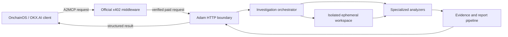

# Adam

Adam is an autonomous software engineering and security investigation agent being
designed as an Agent Service Provider (ASP) for OKX.AI.

Adam inspects software systems, correlates technical evidence, and returns
prioritized, actionable conclusions. It is not a chatbot, an IDE autocomplete
tool, a generic code generator, or a hackathon judging agent.

## Project status

**Milestone 0: Architecture and Foundation**

The repository currently contains documentation only. This is intentional.
Runtime code, payment integration, analyzers, and deployment configuration will
not be created until the Milestone 0 architecture is reviewed and approved.

Last documentation review: **July 22, 2026**

## Initial services

### Security Audit

Given a public GitHub repository, Adam will:

- map the repository and detect its technology stack;
- inspect dependencies, configuration, secrets exposure, authentication, and
  authorization;
- inspect smart contracts when present;
- identify and prioritize likely vulnerabilities;
- explain evidence, impact, and remediation;
- return a security score and severity-ranked findings.

The emphasis is evidence-backed engineering reasoning, not merely matching a
vulnerability signature database.

### Root Cause Investigation

Given a public GitHub repository and deployment, runtime, or CI logs, Adam will:

- understand the relevant repository structure;
- normalize and correlate failures across code, configuration, and logs;
- identify the most probable root cause;
- state confidence and supporting evidence;
- recommend a fix and prevention measures.

## Product principles

- **Simple input:** users request an outcome, not a collection of analysis
  modules.
- **Evidence first:** every conclusion must be traceable to repository or log
  evidence.
- **Safe by default:** untrusted repositories are inspected without executing
  their code in the initial release.
- **Cloud first:** the production service must not depend on a developer
  computer remaining online.
- **Bounded services:** the initial A2MCP operations will have explicit,
  enforceable scope and input limits.
- **Professional engineering:** strong typing, structured logging, clear
  ownership, and production-grade error handling are required when
  implementation begins.

## Architecture at a glance



Adam will run as an independently hosted HTTPS service. OKX.AI provides
identity, discovery, service registration, and payment-aware invocation; Adam
owns the investigation runtime and its operational security.

See [ARCHITECTURE.md](ARCHITECTURE.md) for the complete proposed design and
[docs/OFFICIAL_SOURCES.md](docs/OFFICIAL_SOURCES.md) for the reviewed official
documentation and known ambiguities.

## Proposed repository layout

The following layout is approved in principle by the architecture but has not
yet been scaffolded:

```text
.
|-- .github/
|   `-- workflows/
|-- docs/
|   |-- OFFICIAL_SOURCES.md
|   |-- adr/
|   |-- operations/
|   `-- service-contracts/
|-- src/
|   |-- analyzers/
|   |-- config/
|   |-- investigation/
|   |-- payments/
|   |-- platform/
|   |-- reporting/
|   |-- services/
|   |-- shared/
|   `-- transport/
|-- test/
|   |-- contract/
|   |-- fixtures/
|   |-- integration/
|   `-- unit/
|-- ARCHITECTURE.md
|-- CONTRIBUTING.md
|-- README.md
|-- package.json
|-- tsconfig.json
`-- railway.json
```

Directories will be introduced only when they contain working code or an active
document. Empty placeholder architecture will not be committed.

## Milestone plan

1. **Milestone 0:** approve architecture, service boundaries, deployment model,
   and official integration assumptions.
2. **Milestone 1:** create the typed TypeScript service skeleton, health routes,
   configuration validation, logging, and CI.
3. **Milestone 2:** integrate and contract-test the official x402 seller flow.
4. **Milestone 3:** deliver one bounded Security Audit vertical slice.
5. **Milestone 4:** deliver one bounded Root Cause Investigation vertical slice.
6. **Milestone 5:** harden isolation, observability, reliability, and Railway
   deployment.
7. **Milestone 6:** register, validate, and publish the ASP service in OKX.AI.

Each milestone requires review before the next milestone begins.

## Current constraints

- The first release supports public GitHub repositories only.
- Adam will not execute repository scripts, package managers, builds, tests, or
  smart contracts by default.
- Private repository authentication, arbitrary log URLs, asynchronous jobs, and
  A2A task handling are outside the initial approved scope.
- Exact request limits, pricing, supported chains, and production service
  metadata remain approval items.

## Repository and license

The intended canonical repository was provided as
`https://github.com/onchaindc/Adam`. It was not publicly reachable during the
July 22, 2026 review, and this local Git repository has no `origin` configured.

No open-source license has been selected. Until a license is added, standard
copyright restrictions apply.
